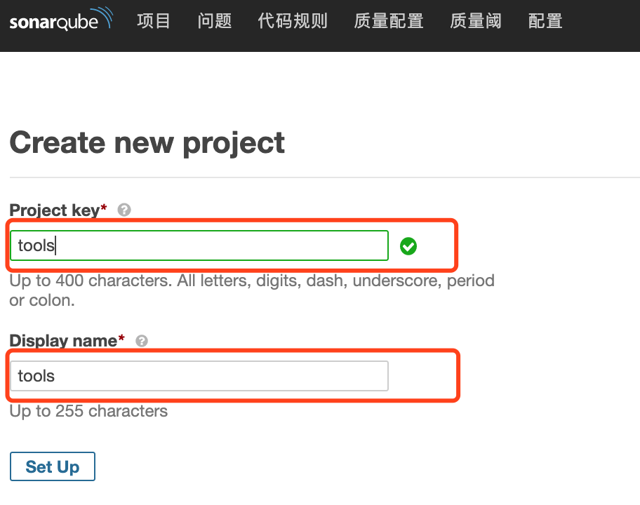
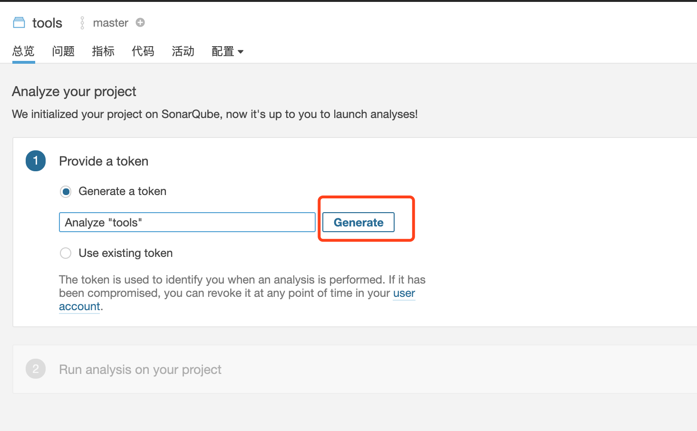
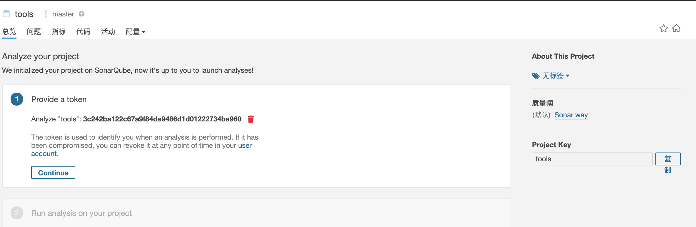
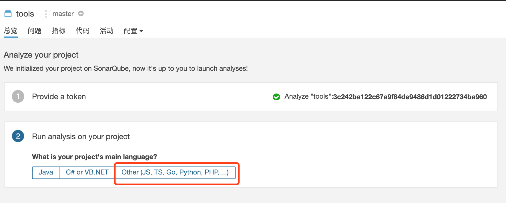
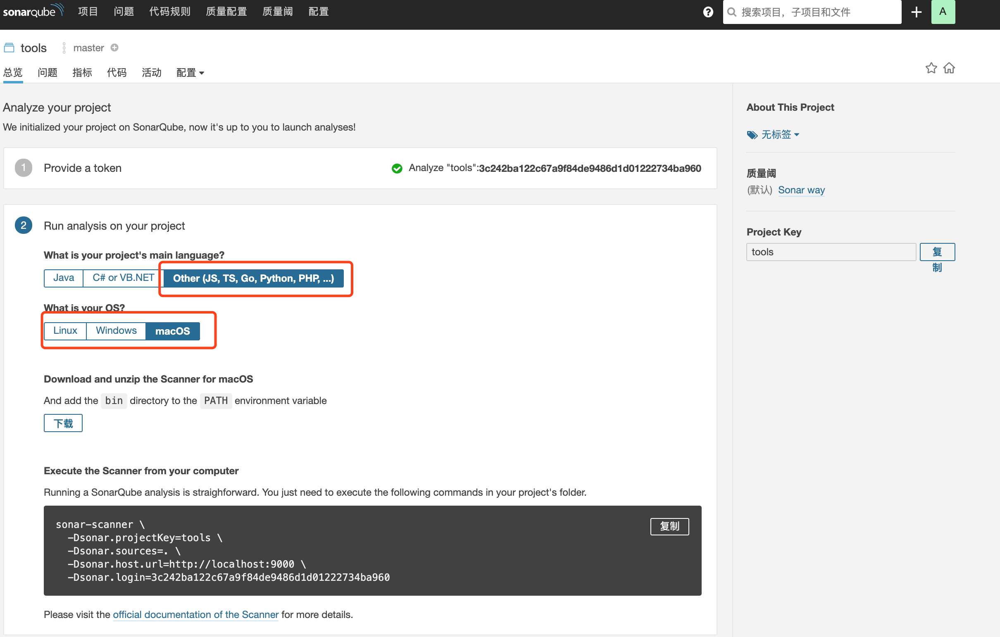
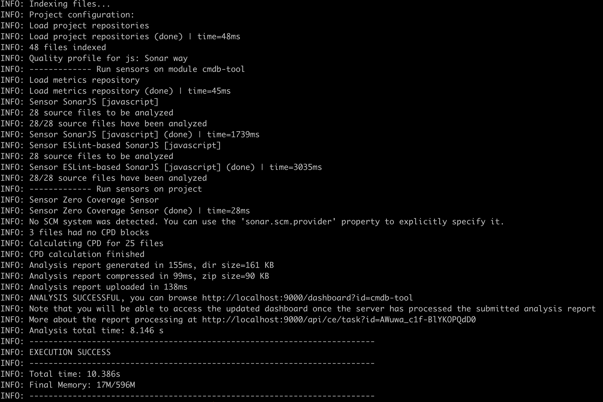
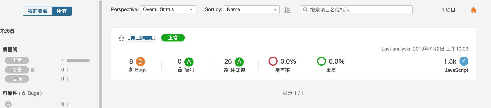

# SonarQube-javascript

## 搭建JavaScript代码质量检测平台(中文) SonarQube

### 下载docker-compose.yml文件
```
$ git clone https://github.com/songjian925/SonarQube-javascript.git
$ cd SonarQube-javascript
```
### 启动SonarQube服务
```
$ docker-compose up -d 
```

### 使用SonarQube
 - 浏览器访问url => localhost:9000   
 - 输入用户名/密码 => username/password：admin/admin
 - 新建项目名称,输入Key和Name,后面配置文件会用到   

 
 - 点击Set Up按钮,生成token,如果已经申请过了,也可以使用已存在的token,就选择Use existing token选项

 
 - 生成token之后,点击Continue按钮

 
 - 出现Run analysis on your project界面

 
 - 选择对应的语言和操作系统,这里建议单独安装 sonar-scanner 工具,下面是Mac系统的sonar-scanner安装方法  

 
 - 安装sonar-scanner之后在sonar-project.properties同级目录下执行命令
 ```
 sonar-scanner
 ```
 - 出现如下图所示结果证明成功了

 
 - 再次访问Web端,如下图所示就完成基本配置了

 

### 在项目中使用SonarQube
- 这里使用sonar-scanner命令来配置项目,下面是Mac系统下安装sonar-scanner方法,其他系统请自行谷歌
```
brew install sonar-scanner
```
- 编写sonar-scanner配置文件,在项目根目录中新建sonar-project.properties
```
# must be unique in a given SonarQube instance
sonar.projectKey=项目唯一标示
# this is the name displayed in the SonarQube UI
sonar.projectName=项目名称
sonar.projectVersion=1.0

# Path is relative to the sonar-project.properties file. Replace "\" by "/" on Windows.
# Since SonarQube 4.2, this property is optional if sonar.modules is set.
# If not set, SonarQube starts looking for source code from the directory containing
# the sonar-project.properties file.
sonar.sources=源代码地址

# Encoding of the source code. Default is default system encoding
#sonar.sourceEncoding=UTF-8
```

### 目录结构
```
SonarQube-javascript
├── README.md               说明文档
├── docker-compose.yml      配置文件
├── postgresql              pg数据库文件
│   └── data
└── sonarqube               sonarqube插件
    └── extensions
        └── plugins
            ├── sonar-javascript-plugin-5.2.1.7778.jar
            └── sonar-l10n-zh-plugin-1.16.jar
```